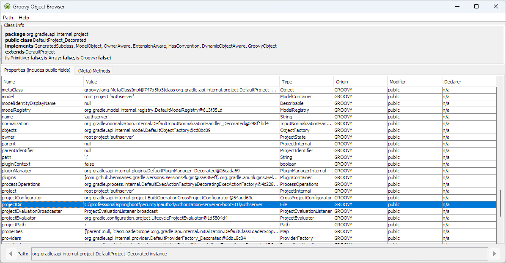

# vscode-gradle-groovysh README

Extends Gradle for Java VSCode extension.

Use ```vscode-gradle-groovysh.groovysh``` to run ```groovysh``` in the context of the gradle build. Once the groovysh is launched try the following command:

```
> gradlew -q --console=plain --init-script .../groovysh-task.gradle gradle-groovysh
Groovy Shell (4.0.13, JVM: 17.0.5)
Type ':help' or ':h' for help.
-------------------------------------------------------------------------------
groovy:000> # Available objects: gradle, settings, project
groovy:001> # Try :inspect project
groovy:001> # :inspect project

```

to launch the Groovy Object Browser GUI.



You can drill down the table rows by double clicking on the row.

## Features

|Name|Description|Contexts|
|-|-|-|
|vscode-gradle-groovysh.groovysh|Start groovysh in build context|Gradle Projects view title|

## Requirements

## Extension Settings

## Known Issues

## Release Notes

### 1.0.0

Initial release.
